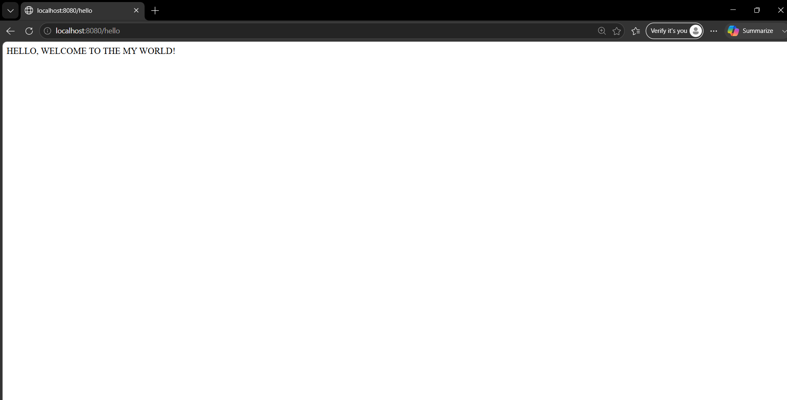

# 🚀 Spring Boot REST API Demo

A simple REST API application developed using **Spring Boot** to demonstrate the fundamentals of building RESTful web services. This project provides basic REST endpoints using Spring Boot annotations and serves as a beginner-friendly introduction to REST API development.

---

## 📖 Project Overview

This project demonstrates how to:

- Create a Spring Boot application
- Build REST APIs using `@RestController`
- Handle HTTP GET requests using `@GetMapping`
- Run and test Spring Boot applications
- Understand the basic architecture of a RESTful web service

---

## ✨ Features

- Simple REST API implementation
- Two GET API endpoints
- Lightweight and easy to understand
- Beginner-friendly project structure
- Built using Spring Boot and Maven

---

## 🛠️ Technologies Used

- Java
- Spring Boot
- Spring Web
- Maven
- REST API

---

## 📂 Project Structure

```text
src
├── main
│   ├── java
│   │   └── com.example.demo
│   │       ├── Controller
│   │       │   └── MruhController.java
│   │       └── DemoApplication.java
│   └── resources
│       └── application.properties
└── test
```

---

## 🔗 API Endpoints

| HTTP Method | Endpoint | Description |
|-------------|----------|-------------|
| GET | `/hello` | Returns a welcome message |
| GET | `/trainer` | Returns a training message |

---

## ▶️ Running the Application

### 1. Clone the Repository

```bash
git clone https://github.com/anusha-seelam/Spring-Boot-REST-API-Demo.git
```

### 2. Navigate to the Project Directory

```bash
cd Spring-Boot-REST-API-Demo
```

### 3. Run the Application

```bash
mvn spring-boot:run
```

### 4. Access the API

Open your browser and visit:

```
http://localhost:8080/hello
```

```
http://localhost:8080/trainer
```

---

## 📸 Project Output

### Hello API Output



---

### visit API Output


---

## 🎯 Learning Outcomes

Through this project, I gained practical experience in:

- Spring Boot application development
- REST API development
- Creating REST Controllers
- Handling HTTP GET requests
- Maven project management
- Testing REST endpoints
- Understanding Spring Boot project structure

---

## 👩‍💻 Author

**Anusha Seelam**

**B.Tech Student | Aspiring Data Scientist | Python | SQL | Power BI | Machine Learning | Generative AI | Data Analytics**

---

## ⭐ Support

If you found this project helpful, consider giving it a ⭐ on GitHub.
